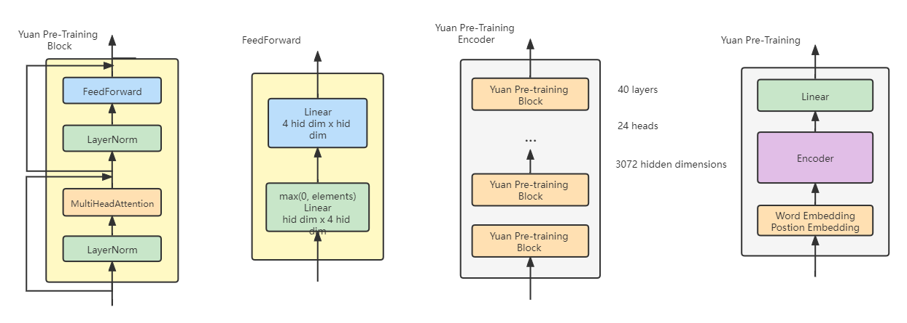
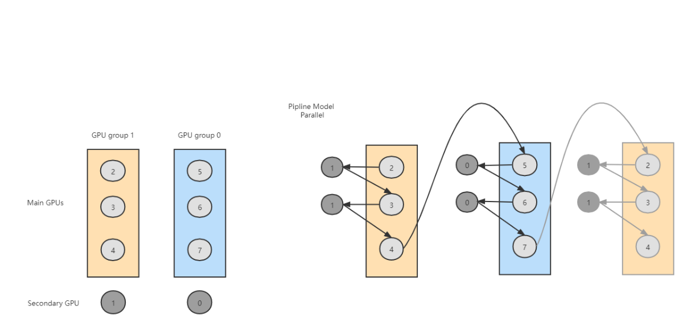

# <center>YUAN</center>
## 1 README
### 1.1 Problem Introduction
- To solve the third question "yuan" in ASC2022, we built a small "yuan" 1.0 model and trained it on a server with 8 GPUs (NVIDIA A100).
- You can find the Official Competition Document in this repo.

### 1.2 Env Introduction
|Object|INFORMATION|
|-|-|
|Operating systems|Linux CentOS 7.9 x86_64|
|PYTHON|3.6.8|
|TORCHTEXT|0.9.1|
|PYTORCH|torch-1.8.1+cu111|
|JIEBA|0.42.1|
|TENSORBOARD|2.8.0|


## 2 Document Description
### 2.1 Doc Tree

```
├─README
│
├─image
│      Yuan_pre-training_model.png
│      GPU_group.png
│
├─Log
│      integry_gpu3+3_yuanformal2022-02-26_07-25-46
│
├─Model
│  │  config.py
│  │  data_cleaner_o.py
│  │  data_iterator.py
│  │  main.py
│  │  model.py
│  │  split_file.py
│  │  train.py
│  │
│  ├─image
│  │      Yuan_pre-training_model.png
│  │
│  ├─log
│  ├─model
│  ├─split_data
│  │      001.txt
│  │      002.txt
│  │      003.txt
│  │      004.txt
│  │      005.txt
│  │      006.txt
│  │      007.txt
│  │      008.txt
│  │
│  └─vocab
│          vocab
│
└─Tensorboard
    └─Feb26_07-25-46_i-z3ybawnr
            events.out.tfevents.1645831546.i-z3ybawnr.67500.0
```

### 2.1 Code Module Description
|Module|File|
|------|-----------|
|Main File|main.py|
|Data Preprocess|data_cleaner.py,split_file.py|
|Object Parameters|config.py|
|Data Loader|data_iterator.py|

## 3 Model Introduction

### 3.1 Model Structure



- The model block (layer) and feedforward bock (layer) is according to the requirements of the subject. But the shape of the mask refers to GPT.
- The pre-training model plans that input data is firstly processed by LayerNorm before MultiHeadAttention and FeedForward.
- FeedForward consists of two Linear blocks (layers). The shape of the first one is the number of hidden dimensions x 4 number of hidden dimensions and the output elements of it should be greater than 0. The shape of another one is 4 number of hidden dimensions x number of hidden dimensions, which change the shape of the tensor and make it can be accepted by the next block. The number of hidden dimensions is 3072.
- According to the subject, every MultiHeadAttention layer has 24 heads.There are two embedding blocks (layers). One of them transfers words sequences into number tensors while another one encodes the position information into a tensor. Shapes of them are the number of input dimensions x number of hidden dimensions and 90000 x number of hidden dimensions. The reason for 90000 is that we want the total parameters of the model to conforms to the requirements of the subject.
- The pre-training model implemented by us contains 40 these blocks (layers), two embedding blocks (layers) and a Linear block (layer) at the output terminal.

### 3.2 GPUS Group Structure

- we plan to introduce the strategy of training a large language model and splitting it. Limited by the GPU’s memory, even three GPUs can’t finish training one block (layer) while the whole model has 40 blocks (layers). The mind of the strategy is splitting the computation of the model into many pieces and putting these pieces into two GPUs group. One group has 4 GPUs and two groups have the same structure. One group calculates one block (layer) and two groups cooperate to form a pipeline. The output tensor of one block (layer) is put into another group as an input tensor.
- We name two groups as group1 and group2. Group1 contains GPU 2,3,4 and 1 while group2 contains GPU 5,6,7 and 0. In group1, GPU 2 and 3 compute the most calculations of MultiHeadAttention block (layer), GPU 4 calculates FeedForward. GPU 1 takes a part of calculations of MultiHeadAttention block (layer), reducing the pressure of memory of GPU 2,3 and 4. In addition, GPU 1 calculates the value of the loss. The roles of GPU 5,6 and 7 are the same as GPU 2,3 and 4. GPU 0 also is responsible for tasks of a part of calculations of MultiHeadAttention block (layer) and FeedForward block (layer). And GPU 0 calculates the last Linear block (layer) as well.


